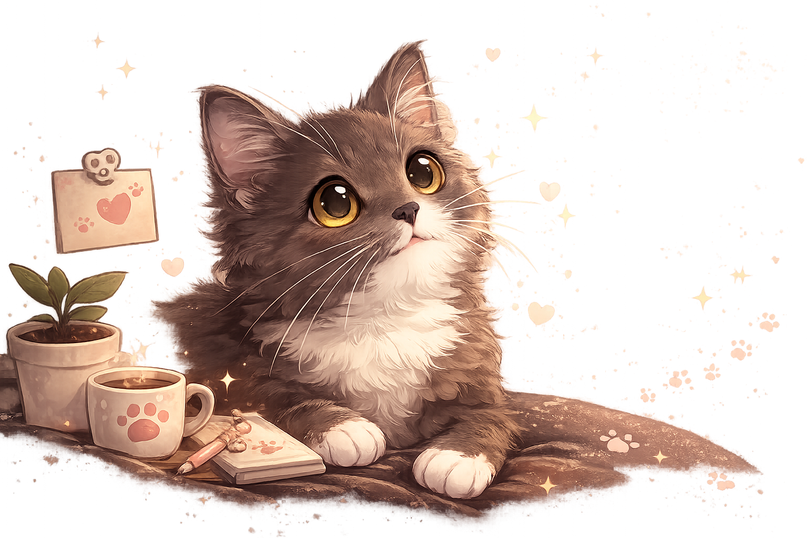
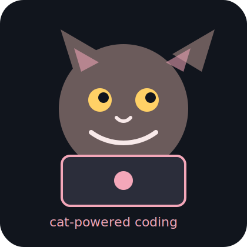
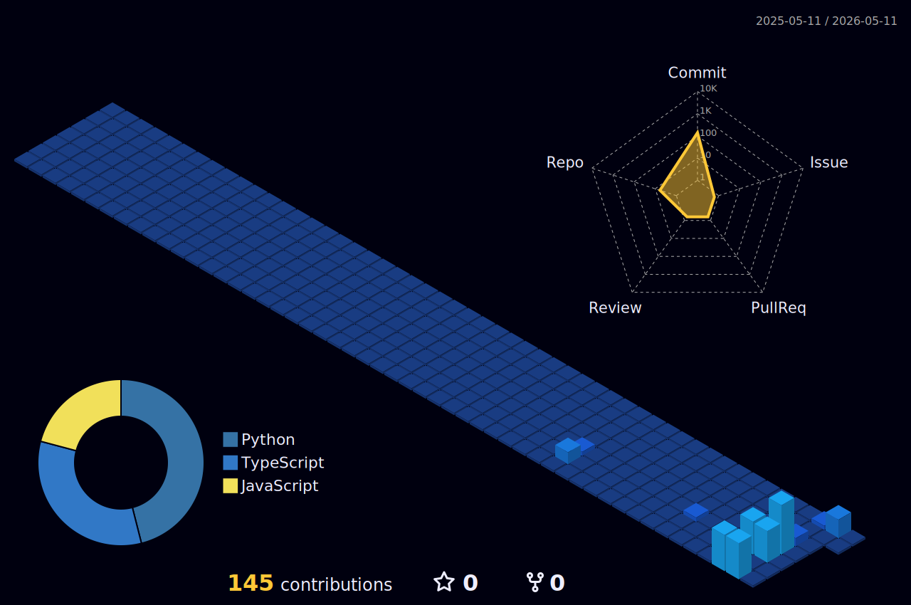
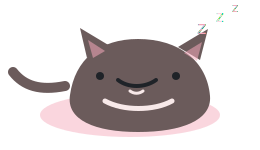

 

<h1>
  
</h1>

  

  
  
  
  

<h2>
  
</h2>

- 🎓 **Economics student** at Chiang Mai University
- 🎨 **Vibe coder** — coding for fun, not for a living (yet 😺)
- 🐱 Powered by cats, coffee, and curiosity
- ✨ **Goal:** Do what makes my heart happy, one project at a time
- 💭 Learning by building random things that spark joy

 

 

<h2>
  
</h2>

  

  
  
  
  

<h2>
  
</h2>

<h2>
  
</h2>

  

  

<h2>
  
</h2>

<h2>
  
</h2>

<h2>
  
</h2>

<h2>
  
</h2>

<picture>
  <source media="(prefers-color-scheme: dark)" srcset="https://raw.githubusercontent.com/Kwenchy11-11/Kwenchy11-11/output/github-contribution-grid-snake-dark.svg" />
  <source media="(prefers-color-scheme: light)" srcset="https://raw.githubusercontent.com/Kwenchy11-11/Kwenchy11-11/output/github-contribution-grid-snake.svg" />
  
</picture>

<h3>
  
</h3>

  
  <b>Have a purrfect day</b>
  

 

 

🎁 <b>Click for a surprise</b> (if you dare)

 

 

 

<b>If you're reading this, you're awesome!</b>

